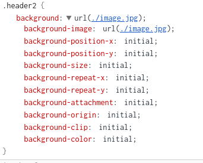

# Background Shorthand Property

## First

[Read From Mozilla Developer Network]([https://link](https://developer.mozilla.org/en-US/docs/Web/CSS/background))

## Second

    just open in the inspector of browser , then set every element that you want in order of the shown picture above
